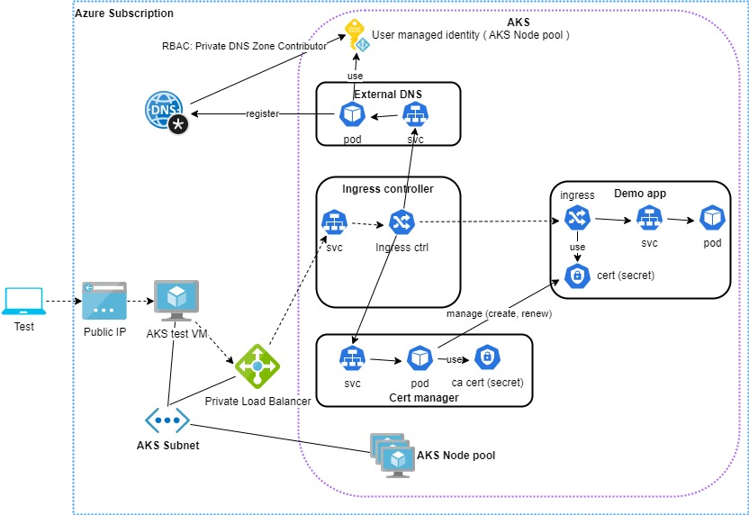

# AKS Demo

This tutorial demonstrates the followings:
- Azure AKS deployment
- AKS ingress controller setup with private load balancer
- AKS application Azure private DNS zone auto registration ( external dns )
- AKS SSL handling with ingress controller ( cert maneger ) 



## Usage

The deployment and the setup process is in the aks.ps1 power shell script file. The script file contains commands with:
- Azure cli
- kubectl
- helm
- powershell

To run the script you need access to the internet. The deployed extensions are downloaded from the internet.

Before the first run, set your subscription id in the aks.ps1 file. Also set the other parameters according to your taste, not mandatory.
From the command line run an az login command, then you can run the script.

## Private DNS zone

The script creates an Azure private DNS zone where the ingress hosts will be registered. The name can be overridden by a parameter in the aks.ps1 file.

## AKS deployment

It deploys a simple AKS with managed identities and autoscale features with one active node.

## Ingress controller

The demo uses the Kubernetes ingress nginx controller. 
https://kubernetes.io/docs/concepts/services-networking/ingress/
https://github.com/kubernetes/ingress-nginx

Please note it is not the same as the Nginx Ingress controller.

The deployment has an extra file attributum: internal-ingress.yml, that sets the Azure load balancer to private. The deploy is completed by helm.


## External DNS

For further info, have a look at the documentation. https://github.com/kubernetes-sigs/external-dns

The deployment file is external-dns.yml and run by kubectl apply -f command. The yml file is generated from external-dns.yml.tpl to replace the subscription id. It is set up to register into an Azure Private DNS zone, if you want to use a public zone you have to modify the setup in the external-dns.yml.tpl and also in the aks.ps1 file for the proper RBAC role! 

## Cert manager

For further info, have a look at the documentation. https://cert-manager.io/docs/

The deployment is completed by helm.
The cert manager uses a CA issuer, the CA cert and key files are ca.crt and ca.key. You can create your own to replace the original files.


## Demo app

The test application is an Nginx deployment. The demo app deployment is in the testapp.yml Kubernetes manifest file

### External DNS setup

There is no set up in the demo app. The external dns is not limited to any Kubernetes namespace, it watches the new ingress resources to register the service host inti the Azure private DNS zone.

### Cert manager setup

The testapp.yml Kubernetes manifest file ingress part contains the setup.

annotation:
```
cert-manager.io/cluster-issuer: ca-cluster-issuer
cert-manager.io/common-name: demoapp.demoaks.com
cert-manager.io/duration: 720h
```

certificate secret reference:
```
tls:
- hosts:
  - demoapp.demoaks.com
  secretName: demoapp-secret    
```


## Test

Log in to the aksdemotester VM - your IP will differ. The VM is in the AKS node pool resource group. 
The username and the password is not protected in the aks.ps1 file, modify and secure it for yourself!!!

Please check the generated Private DNS zone records, the demoapp host should be registered in it.

Test
```
ssh azureadmn@20.166.38.234

curl -v -k https://demoapp.demoaks.com
```

Result, have look at the subject and the issuer and the URL that is called!
```
* Rebuilt URL to: https://demoapp.demoaks.com/
*   Trying 10.224.0.6...
* TCP_NODELAY set
* Connected to demoapp.demoaks.com (10.224.0.6) port 443 (#0)
* ALPN, offering h2
* ALPN, offering http/1.1
* successfully set certificate verify locations:
*   CAfile: /etc/ssl/certs/ca-certificates.crt
  CApath: /etc/ssl/certs
* TLSv1.3 (OUT), TLS handshake, Client hello (1):
* TLSv1.3 (IN), TLS handshake, Server hello (2):
* ....
* TLSv1.3 (OUT), TLS handshake, Finished (20):
* SSL connection using TLSv1.3 / TLS_AES_256_GCM_SHA384
* ALPN, server accepted to use h2
* Server certificate:
*  subject: CN=demoapp.demoaks.com
*  start date: Jan  3 15:44:50 2023 GMT
*  expire date: Feb  2 15:44:50 2023 GMT
*  issuer: CN=demoaks.com; C=HU; L=Budapest
*  SSL certificate verify result: unable to get local issuer certificate (20), continuing anyway.
* Using HTTP2, server supports multi-use
* Connection state changed (HTTP/2 confirmed)
* Copying HTTP/2 data in stream buffer to connection buffer after upgrade: len=0
* TLSv1.3 (OUT), TLS Unknown, Unknown (23):
* TLSv1.3 (OUT), TLS Unknown, Unknown (23):
* TLSv1.3 (OUT), TLS Unknown, Unknown (23):
* Using Stream ID: 1 (easy handle 0x562ba1a02620)
* TLSv1.3 (OUT), TLS Unknown, Unknown (23):
> GET / HTTP/2
> Host: demoapp.demoaks.com
> User-Agent: curl/7.58.0
> Accept: */*
> 
* TLSv1.3 (IN), TLS Unknown, Certificate Status (22):
* TLSv1.3 (IN), TLS handshake, Newsession Ticket (4):
* TLSv1.3 (IN), TLS Unknown, Certificate Status (22):
* TLSv1.3 (IN), TLS handshake, Newsession Ticket (4):
* TLSv1.3 (IN), TLS Unknown, Unknown (23):
* Connection state changed (MAX_CONCURRENT_STREAMS updated)!
* TLSv1.3 (OUT), TLS Unknown, Unknown (23):
* TLSv1.3 (IN), TLS Unknown, Unknown (23):
* TLSv1.3 (IN), TLS Unknown, Unknown (23):
< HTTP/2 200 
< date: Tue, 03 Jan 2023 16:07:14 GMT
< content-type: text/html
< content-length: 615
< last-modified: Tue, 13 Dec 2022 15:53:53 GMT
< etag: "6398a011-267"
< accept-ranges: bytes
< strict-transport-security: max-age=15724800; includeSubDomains
< 
<!DOCTYPE html>
<html>
<head>
<title>Welcome to nginx!</title>
<style>
html { color-scheme: light dark; }
body { width: 35em; margin: 0 auto;
font-family: Tahoma, Verdana, Arial, sans-serif; }
</style>
</head>
<body>
<h1>Welcome to nginx!</h1>
<p>If you see this page, the nginx web server is successfully installed and
working. Further configuration is required.</p>

<p>For online documentation and support please refer to
<a href="http://nginx.org/">nginx.org</a>.<br/>
Commercial support is available at
<a href="http://nginx.com/">nginx.com</a>.</p>

<p><em>Thank you for using nginx.</em></p>
</body>
</html>
* TLSv1.3 (IN), TLS Unknown, Unknown (23):
* Connection #0 to host demoapp.demoaks.com left intact
```